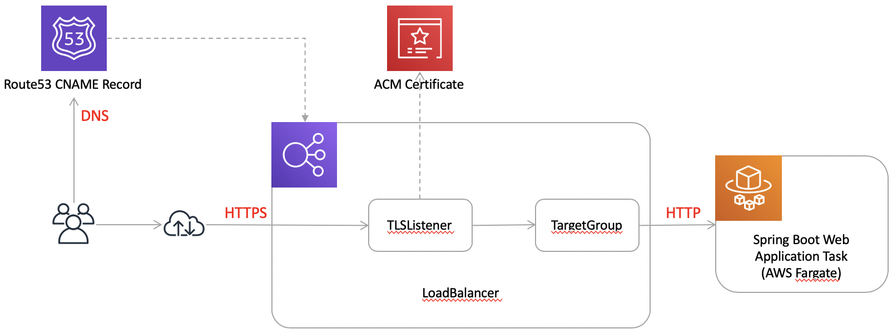
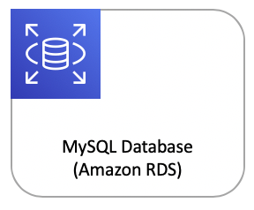

# Let's play with Spring Boot and AWS Fargate

Target Architecture:
- Load balancer: Application Load Balancer (with TLS-termination)
- Web application: containerized Java (Spring Boot-) application running as a AWS Fargate service
- Database: Amazon RDS for MySQL instance

## All automated - from zero to cloud in 13'

### Pre-Conditions

- AWS cli installed & configured (sufficient IAM permissions, default region configured)
- Default VPC is present in the default AWS region
- Docker is running
- Linux-like environment or macOS (bash, curl, sed, ...) 
- openssl installed
- jq installed
- General advice: read - and understand - all shell scripts and CloudFormation yaml templates before executing them

### Automated dev env setup (ECR + ALB + Fargate Service + RDS)

Disclaimer:
- Not production ready yet (e.g. automation scripts w/o error handling)
- Costs (until teardown): approx. 75 USD/month

    ./setup-dev.sh
    ./curl-loop-dev.sh

### Deploy new application version

    ./update-dev.sh

### Automated dev env teardown (delete all stacks/resources)

Disclaimer:
- Not production ready yet (e.g. automation scripts w/o error handling)
- All data lost!

    ./teardown-dev.sh

## Behind the scenes (CloudFormation and AWS cli)

### Network Security

 
Requirements:
- End user web browsers can only communicate with the load balancer (HTTPS, port 443)
- Only the load balancer can communicate with the web application (HTTP, port 8080)
- Only the web application can communicate with the database (MySQL, port 3306)

Properly configured VPC Security Groups meet these requirements.

CloudFormation yaml template (some details omitted):

    ...
    Resources:
        LoadBalancerSG:
            Type: AWS::EC2::SecurityGroup
            Properties: 
            GroupDescription: HTTPS
            SecurityGroupIngress: 
                -  IpProtocol: "tcp"
                   FromPort: 443
                   ToPort: 443
                   CidrIp: "0.0.0.0/0"
                   VpcId: !Ref VPC

        ApplicationSG:
            Type: AWS::EC2::SecurityGroup
            Properties: 
            GroupDescription: HTTP 8080
            SecurityGroupIngress: 
                -  IpProtocol: "tcp"
                   FromPort: 8080
                   ToPort: 8080
                   SourceSecurityGroupId: !GetAtt LoadBalancerSG.GroupId
            VpcId: !Ref VPC

        DatabaseSG:
            Type: AWS::EC2::SecurityGroup
            Properties: 
            GroupDescription: MySQL
            SecurityGroupIngress: 
                -  IpProtocol: "tcp"
                   FromPort: 3306
                   ToPort: 3306
                   SourceSecurityGroupId: !GetAtt ApplicationSG.GroupId           
            VpcId: !Ref VPC
        ...

Create the CloudFormation stack via AWS cli:

    export DEFAULT_VPC_ID="vpc-c2..." #your vpc id 
    export SUBNET_IDS="subnet-4e...,subnet-40...,subnet-57..." #your subnet ids

    aws cloudformation create-stack \
        --stack-name samplewebworkload-net-dev \
        --template-body file://network-cf.yaml \
        --parameters ParameterKey=Subnets,ParameterValue=\"$SUBNET_IDS\" \
                     ParameterKey=VPC,ParameterValue=$DEFAULT_VPC_ID

### Load Balancer

 
Requirements:
- Load balancer must be reachable via a custom domain name
- Load balancer must terminate HTTPS traffic
- Load balancer must forward traffic to our application via HTTP

A properly configured Application Load Balancer meets the requirements:
- TLSListeer: terminates HTTPS traffic and is associated with a previosly created AWS Certificate Manager TLS certificate
- TargetGroup: forwards all traffic to the application via HTTP
- A Route53 CNAME record can refer the CNAME of the Application Load Balancer in a subsequent step

CloudFormation yaml template (some details omitted):

    ...
    Resources:
        TargetGroup:
            Type: AWS::ElasticLoadBalancingV2::TargetGroup
            Properties:
                HealthCheckIntervalSeconds: 30
                HealthCheckPath: /
                HealthCheckTimeoutSeconds: 5
                UnhealthyThresholdCount: 4
                HealthyThresholdCount: 2
                Port: 8080
                Protocol: HTTP
                TargetGroupAttributes:
                    - Key: deregistration_delay.timeout_seconds
                      Value: 60 
                TargetType: ip
                VpcId: !Ref VPC

        TLSListener:
            Type: AWS::ElasticLoadBalancingV2::Listener
            Condition: EnableTLS
            Properties:
                Certificates: 
                    - CertificateArn: !Ref CertificateArn
                DefaultActions:
                    - TargetGroupArn: !Ref TargetGroup
                      Type: forward
                LoadBalancerArn: !Ref LoadBalancer
                Port: 443
                Protocol: HTTPS

        LoadBalancer:
            Type: AWS::ElasticLoadBalancingV2::LoadBalancer
            Properties:
                LoadBalancerAttributes:
                    - Key: idle_timeout.timeout_seconds
                      Value: 60
                Scheme: internet-facing
                SecurityGroups:
                    - !Ref SecurityGroup
                Subnets: !Ref Subnets
        ...

Create the CloudFormation stack via AWS cli:

    SG_ID="sg-12..." #your security group id
    DEFAULT_VPC_ID="vpc-c2..." #your vpc id 
    SUBNET_IDS="subnet-4e...,subnet-40...,subnet-57..." #your subnet ids
    SSL_CERT_ARN="arn:aws:acm:eu-west-1:20...:certificate/73..." #your ACM cert ARN

    aws cloudformation create-stack \
        --stack-name samplewebworkload-lb-dev \
        --template-body file://lb-cf.yaml \
        --parameters ParameterKey=Subnets,ParameterValue=\"$SUBNET_IDS\" \
                     ParameterKey=VPC,ParameterValue=$DEFAULT_VPC_ID \
                     ParameterKey=SecurityGroup,ParameterValue=$SG_ID \
                     ParameterKey=CertificateArn,ParameterValue="$SSL_CERT_ARN"

### Database

 
Requirements: Managed MySQL database

An Amazon RDS for MySQL database instance meets the requirements.

CloudFormation yaml template (some details omitted):

    ...
    Resources:
        DBSubnetGroup:
            Type: "AWS::RDS::DBSubnetGroup"
            Properties: 
                DBSubnetGroupDescription: db subnet group
                SubnetIds: !Ref Subnets

        DB:
            Type: AWS::RDS::DBInstance
            Properties:
                DBSubnetGroupName: !Ref DBSubnetGroup
                DBName: db
                VPCSecurityGroups:
                    - Ref: SecurityGroup
                AllocatedStorage: '5'
                DBInstanceClass: db.t3.micro
                Engine: MySQL
                MasterUsername: masteruser
                MasterUserPassword: !Ref MasterUserPassword
                DeletionPolicy: Delete
        ...

Create the CloudFormation stack via AWS cli:

    SG_ID="sg-34..." #your security group id
    DEFAULT_VPC_ID="vpc-c20263a4" #your vpc id 
    SUBNET_IDS="subnet-4e...,subnet-40...,subnet-57..." #your subnet ids
    DB_KEY="..." #your secret key

    aws cloudformation create-stack \
        --stack-name samplewebworkload-db-dev \
        --template-body file://db-cf.yaml \
        --parameters ParameterKey=Subnets,ParameterValue=\"$SUBNET_IDS\" \
                     ParameterKey=SecurityGroup,ParameterValue=$SG_ID \
                     ParameterKey=MasterUserPassword,ParameterValue=$DB_KEY

### Privte Docker Registry

 
Requirements: a private docker registry

An Elastic Container Registry meets the requirements.

CloudFormation yaml template (some details omitted):

    ...
    Resources:
        DockerRepo:
            Type: AWS::ECR::Repository
            Properties: 
                RepositoryName: !Ref 'AWS::StackName'
        ...

Create the CloudFormation stack via AWS cli:

    aws cloudformation create-stack \
        --stack-name samplewebworkload-repo-dev \
        --template-body file://repo-cf.yaml

### Spring Boot Application

Requirements:
- Run dockerized Spring Boot web application
- No hard-coded environment specific configuratiomn (DB host & port)
- No passwords in configuration files or environment variables (DB password)
- Centralized logging
- Easy redeployment

The following services (in concert) meet these requirements:
- Run docker containers via AWS Fargate (as a service with one task with one container)
- Force redeployment (via API/AWS cli) after docker push to roll out a new version
- Logging to CloudWatch (Fargate configuration)
- Configuration via environment variables (DB host & port)
- DB password is stored in AWS Systems Manager Parameter Store as secure string

CloudFormation yaml template (some details omitted):

    ...
    Resources:
        # Required for CloudWatch logging, amongst others
        ECSExecutionRole:
            Type: AWS::IAM::Role
            Properties:
                AssumeRolePolicyDocument:
                    Version: "2012-10-17"
                    Statement:
                        - Effect: "Allow"
                          Principal:
                            Service:
                                - "ecs-tasks.amazonaws.com"
                          Action:
                            - "sts:AssumeRole"
                ManagedPolicyArns:
                    - "arn:aws:iam::aws:policy/service-role/AmazonECSTaskExecutionRolePolicy"
                MaxSessionDuration: 3600
                Path: /service-role/

        # Required to read secure strings in AWS Systems Manager Parameter Store
        TaskRole:
            Type: AWS::IAM::Role
            Properties:
                AssumeRolePolicyDocument:
                    Version: "2012-10-17"
                    Statement:
                        - Effect: "Allow"
                          Principal:
                            Service:
                                - "ecs-tasks.amazonaws.com"
                          Action:
                            - "sts:AssumeRole"
                Policies:
                    - PolicyName: !Sub 'TaskRole-${AWS::StackName}'
                      PolicyDocument:
                            Version: 2012-10-17
                            Statement:
                                - Effect: Allow
                            Action:
                                - 'ssm:GetParameter'
                            Resource:
                                - !Sub "arn:aws:ssm:${AWS::Region}:${AWS::AccountId}:parameter/${DBPassSSMName}"
                MaxSessionDuration: 3600
                Path: /service-role/

        TaskLogGroup:
            Type: AWS::Logs::LogGroup
            Properties: 
                LogGroupName: !Join [ '', [ '/ecs/', !Ref 'AWS::StackName' ] ]
                RetentionInDays: 7

        # Spring Boot app task definition & configuration (:latest for simple deployment in dev)
        TaskDefinition:
            Type: AWS::ECS::TaskDefinition
            Properties: 
                ExecutionRoleArn: !GetAtt ECSExecutionRole.Arn
                TaskRoleArn: !GetAtt TaskRole.Arn
                Cpu: "1024"
                Memory: "2048"
                Family: !Ref 'AWS::StackName'
                NetworkMode: "awsvpc"
                RequiresCompatibilities:
                    - "FARGATE"
                ContainerDefinitions:
                    - Cpu: "256"
                      Essential: true
                      Image: !Sub "${AWS::AccountId}.dkr.ecr.${AWS::Region}.amazonaws.com/${DockerRepo}:latest"
                      LogConfiguration:
                        LogDriver: "awslogs"
                        Options:
                            "awslogs-group": !Ref TaskLogGroup
                            "awslogs-region": !Ref 'AWS::Region'
                            "awslogs-stream-prefix": "ecs"
                      Memory: "512"
                      MemoryReservation: "512"
                      Name: !Ref 'AWS::StackName'
                      PortMappings:
                        - ContainerPort: 8080
                          Protocol: "tcp"
                      Environment:
                        - Name: DBPort
                          Value: !Ref DBPort 
                        - Name: DBAddress
                          Value: !Ref DBAddress 
                        - Name: DBPassSSMName
                          Value: !Ref DBPassSSMName

        FargateCluster:
            Type: AWS::ECS::Cluster

        # Running service (with one task with one Spring Boot app container)
        FargateService:
            Type: AWS::ECS::Service
            Properties: 
                Cluster: !Ref FargateCluster
                DeploymentConfiguration:
                    MaximumPercent: 200
                    MinimumHealthyPercent: 100
                DesiredCount: 1
                LaunchType: "FARGATE"
                NetworkConfiguration: 
                    AwsvpcConfiguration: 
                    AssignPublicIp: "ENABLED"
                    SecurityGroups: 
                        - !Ref SecurityGroup
                    Subnets: !Ref Subnets
                PlatformVersion: "LATEST"
                SchedulingStrategy: "REPLICA"
                TaskDefinition: !Ref TaskDefinition
                LoadBalancers:
                    - ContainerName: !Ref 'AWS::StackName'
                      ContainerPort: 8080
                      TargetGroupArn: !Ref TargetGroup
        ...

Create the CloudFormation stack via AWS cli:

    DB_ADDR="localhost" #your RDS host
    DB_PORT=3306 #your RDS port
    SG_ID="sg-34..." #your security group id
    ELB_TARGET_GROUP="..." #your ALB target group id
    DOCKER_REPO_NAME="..." #your ECR registry name
    DEFAULT_VPC_ID="vpc-c20263a4" #your vpc id 
    SUBNET_IDS="subnet-4e...,subnet-40...,subnet-57..." #your subnet ids

    aws cloudformation create-stack \
        --capabilities CAPABILITY_IAM \
        --stack-name samplewebworkload-fargatew-dev \
        --template-body file://fargate-cf.yaml \
        --parameters ParameterKey=Subnets,ParameterValue=\"$SUBNET_IDS\" \
                     ParameterKey=VPC,ParameterValue=$DEFAULT_VPC_ID \
                     ParameterKey=TargetGroup,ParameterValue=$ELB_TARGET_GROUP \
                     ParameterKey=DockerRepo,ParameterValue=$DOCKER_REPO_NAME \
                     ParameterKey=SecurityGroup,ParameterValue=$SG_ID \
                     ParameterKey=DBIdentifier,ParameterValue=$DB_ID \
                     ParameterKey=DBPort,ParameterValue=$DB_ADDR \
                     ParameterKey=DBAddress,ParameterValue=$DB_PORT \
                     ParameterKey=DBPassSSMName,ParameterValue="dev.db.rand.pass"

## AWS Infrastructure

